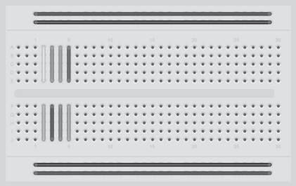
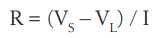

# Microcontrollers

## Protoboard

A protoboard é um dispositivo reutilizável, sem solda, utilizado para prototipar um circuito
eletrônico ou para experimentar projetos de circuitos. A placa consiste em uma série de
furos em uma grade; sob a placa, esses furos são conectados por uma tira de metal condutivo.

As tiras ao longo do topo e da base correm em paralelo à placa, e são projetadas para
carregar o barramento de alimentação e o barramento do terra. Os componentes no
meio da placa convenientemente conectam com os 5V.

## Resistor

A fórmula para calcular o resistor necessário é:

## LED

Significa `Light Emitting Diode (Diodo Emissor de Luz)`. Um diodo é um dispositivo que permite o fluxo de corrente em apenas
uma direção. Caso a corrente tente reverter e retornar na direção oposta, o diodo impede que ela o faça.

Diodos podem ser úteis para prevenir que alguém conecte acidentalmente a alimentação e o terra aos terminais errados em um circuito, danificando os componentes.

